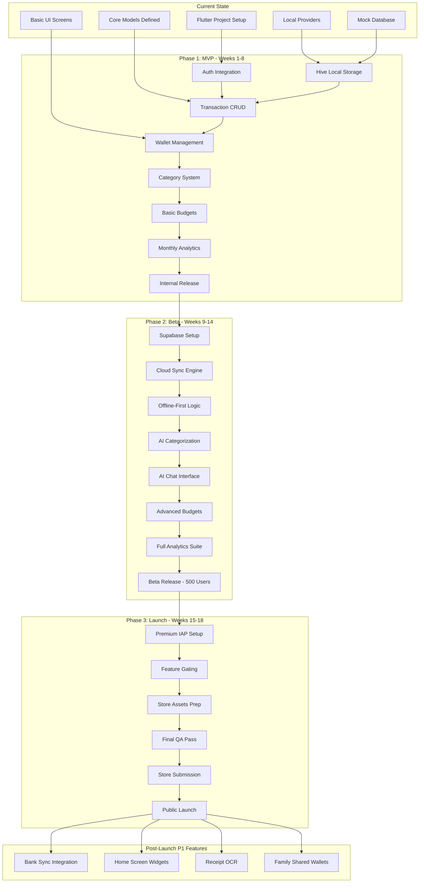
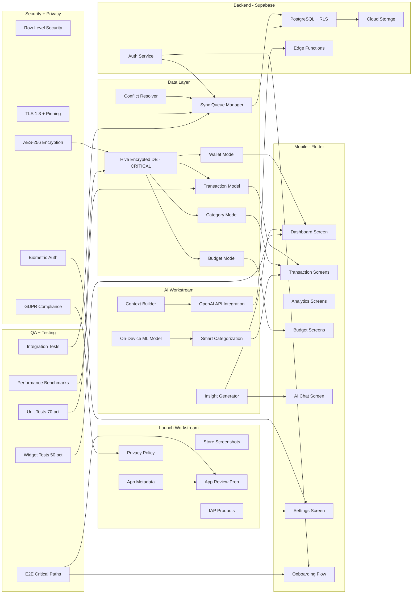
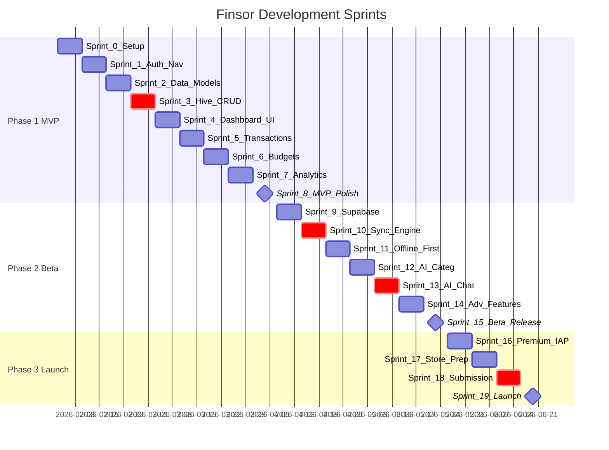

# Finsor Project Visualization

## Progress overview (development progress)

| Sprint    | Status | Focus                                                                                                                             |
| --------- | ------ | --------------------------------------------------------------------------------------------------------------------------------- |
| S0–S8     | ✅ Done | Phase 1 MVP: Setup, Auth, Data, Hive, Dashboard, Transactions, Budgets, Analytics, MVP polish                                     |
| S9–S14    | ✅ Done | Phase 2 Beta: Supabase, Sync engine, Offline-first, AI Categ (foundation), AI Chat (foundation), Adv features, Auth/Sync complete |
| **S15**   | ✅ Done | AI Smart Categorization (local rules, suggestions, corrections, sync)                                                             |
| **S15.5** | ✅ Done | AI Chat polish — unified finance-aware flow, context, AI screen                                                                   |
| **S16**   | ✅ Done | Completion & production hardening (overview, export, backup, subcategories, sync, wallet, defensive)                              |
| **S17**   | ✅ Done | AI Chat production (OpenAI), chat UI polish (markdown, overflow, copy), subcategory creation UX, regression checklist + tests     |
| S18+      | → Next | Beta release prep, Premium IAP polish, Store prep, Launch                                                                         |

**Completed in order (wide sense):**  
S0–S17 complete. Data layer, Auth, Sync, Core screens, IAP, AI Insights, App Lock, Recurring, Goals, Observability, AI Smart Categorization (S15), AI Chat polish (S15.5), Production hardening (S16), AI production + chat polish + subcategory UX + regression (S17) — all in place.

**Next:** Beta release prep / S18 (Premium IAP polish, Store prep).

**Sprint-by-sprint progress (all changes):**

- **S0–S2:** Project setup, Auth/Nav, Data models
- **S3:** Hive CRUD (critical path)
- **S4–S7:** Dashboard, Transactions, Budgets, Analytics
- **S8:** MVP polish
- **S9–S10:** Supabase, Sync engine (critical)
- **S11:** Offline-first, AI Insights upgrade, Observability/Sentry
- **S12:** Full sync orchestration, category management, App lock (PIN/biometric), backup/restore tests
- **S13:** Recurring, Goals, App Lock settings, startOfMonthDay
- **S14:** Supabase Cloud Sync (outbox, realtime, bootstrap, RLS), full Auth (Apple/Google/Email), 229 tests
- **S15:** AI Smart Categorization — local rules, CategorizationService, suggestions in Add Transaction, corrections in Edit, rule sync
- **S15.5:** AI Chat — unified finance-aware flow, context, AI screen polish
- **S16:** Skip onboarding (DEV), Overview metrics (savings rate, biggest expense, avg daily), Export strategy (CSV + PDF/XLSX stubs), Backup import (full replace, validation, delayed sync), Subcategories (tree picker, getDescendantCategoryIds, filter + budget), Sync logging, Wallet currency integrity, Defensive guards, tests
- **S17:** AI Chat production OpenAI (edge error codes AI_CONFIG_ERROR / AI_RATE_LIMIT / AI_TEMPORARY_ERROR, client AIChatException + SnackBar + Retry), Chat UI (Markdown, overflow safety, copy message), Subcategory creation (parent + comma-separated subcategories in one flow), Regression checklist (docs/s17_regression_checklist.md) + tests (category with subcategories, markdown smoke, AI error mapping)

---

## Sprint 17 Complete (2026-02-18) — AI production & hardening

- **AI production:** Edge function returns AI_CONFIG_ERROR (401/403), AI_RATE_LIMIT (429), AI_TEMPORARY_ERROR (timeout/network). Client parses error codes, throws AIChatException; AI screen shows SnackBar with reason and Retry. No API key in client; dataset rules unchanged (client canonical, 50 tx cap, PII stripping). Debug logs (kDebugMode) for tier, request, response, errors.
- **Chat UI:** Assistant messages use MarkdownBody (bullets, headings, bold, code); whitespace normalized; ConstrainedBox + SingleChildScrollView for long replies; copy-message action for assistant.
- **Subcategory creation:** Add/Edit Category when creating parent (parentId == null) shows optional "Subcategories (comma-separated)"; on save creates parent then children with parentId and same type; trim, skip empty, case-insensitive dedup.
- **Regression:** docs/s17_regression_checklist.md with manual steps (auth, wallet, category+subcategories, transaction, filter, budget, analytics, export, backup/restore, sync, AI chat). Tests: category_with_subcategories (children have parentId), ai_message_markdown_smoke (no overflow), AI error mapping (AIChatException userMessage per code).

---

## Sprint 16 Complete (2026-02-18) — Completion & Production Hardening

- **AppConfig / onboarding:** `AppConfig.skipOnboarding` (DEV only); app launches into main flow without flicker.
- **Overview upgrade:** Net Cash Flow, Savings Rate %, Biggest Expense (merchantNormalized/category, no PII), Average Daily Spend; metric cards; empty states; net delta (green/red); primary currency formatting; unit tests for metrics and empty dataset.
- **Export architecture:** `ExportStrategy`, `ExportPayload`, `ExportResult`; `CsvExportStrategy` (default), `PdfExportStrategy` and `XlsxExportStrategy` stubs; export screen unchanged behavior.
- **Backup import:** Full replace only — `clearAllDataForRestore()` + `importDataReplace()`; validate `version == 1` and required keys; robust utf8 decode + jsonDecode (web-safe, no crash on malformed JSON); invalidate providers first, then sync via microtask; "Restore from backup" on Backup screen.
- **Subcategories:** `getDescendantCategoryIds(parentId)` (DFS) for transaction filtering and budget spent; category picker tree (parent → indented children); parent budget includes child expenses; test for parent budget + child transactions.
- **Sync hardening:** No parallel syncs; lightweight logs (Skipped already syncing / offline, Starting sync).
- **Wallet currency:** Balance always in `wallet.currency`; primary currency change confirmation; sanity test (wallet BTC unchanged).
- **Defensive:** Division-by-zero guards; null-safe category lookup; delete category with children already guarded.
- **Tests:** Overview metrics, parent-budget-includes-child, wallet currency integrity.

## Sprint 15.5 Complete — AI Chat polish

- AI Chat unified finance-aware flow and context (transaction/category/wallet data in context).
- AI screen polish and integration with analytics/overview data for answers.

## Sprint 15 Complete — AI Smart Categorization

- **Categorization rules:** Model, local rule engine, sync of rules (Supabase).
- **Smart suggestions:** Add Transaction gets category suggestions from CategorizationService (local rules + optional AI); corrections in Edit; last-used and rules applied.
- **CategorizationService:** Local rule engine, metrics; integration with Add Transaction and Edit.
- **Tests:** Local rule engine, categorization rules (Sprint 15 tests).
- Foundation for S16 subcategories (parentId, tree) and AI dataset (subcategories in context).

---

## Sprint 14 Complete (2026-02-10)

- **Supabase Cloud Sync**: Full offline-first sync engine with outbox pattern
- **Auth**: Apple Sign-In, Google Sign-In, Email+Password (Sign in/up, Verify email code, Forgot password), session persistence
- **Environment**: `.env.dev` / `.env.prod`, `lib/config/env.dart`, persistent `DEVICE_ID`
- **SQL Migrations**: 4 migration files (schema, RLS, indexes, triggers) for 7 tables
- **Sync Engine**: push (outbox → Supabase), delta pull (updated_at > lastSyncAt), conflict resolution (newer wins, device_id tiebreaker), bootstrap (empty local/cloud/both), no-resurrection guard
- **Outbox**: `pending_ops` Hive box, exponential backoff, max 10 retries, failed ops don't loop
- **Realtime**: Postgres Changes subscriptions for all 7 tables, skip own device_id
- **User Settings Sync**: `startOfMonthDay`, `autoLockTimeout` sync as normal entities via outbox
- **Sync UI**: Drawer shows account email, sync status (Idle/Syncing/Offline/Error), Sync Now, pending badge, Logout
- **All notifiers enqueue**: Transaction, Wallet, Category, Budget, Recurring, Goal, Settings
- **Tests**: 229 passing (37 new Sprint 14 tests), 0 failures

## Sprint 13 Complete (2026-02-07)

- Recurring Transactions: dedicated model, RecurringService, generation at app start
- Goals & Debts: Goal model, GoalService with reconciliation, funding/payment flows
- App Lock: autoLockTimeout setting, startOfMonthDay for budgets/analytics
- 192 tests passing (18 new Sprint 13 tests)

## Sprint 12 Complete (2026-02-07)

- Full sync orchestration: transaction add/edit/delete invalidates wallets, budgets, analytics, insights
- Unified data layer: all screens use Hive providers
- Last-used defaults: wallet and category persisted per type
- Transaction search: by description, category, amount
- Reset all data: Settings → Reset App (with confirmation)
- **Category management**: delete with reassignment, reorder; Manage Categories in Settings → Data
- **App lock**: PIN protection (4-digit, SHA256-hashed), biometric unlock; Settings → Security
- **Tests**: sync, transfer (hive_database_service_test), category reassignment, backup/restore integrity
- 138 tests passing

## Sprint 11 Complete (2026-02-07)

- AI Insights upgrade: prioritization by impactScore, de-duplication by category, explainability (reason field)
- Observability: Sentry integration (crash/error reporting + usage events)
- Usage events: app_start, onboarding_completed, premium_upgrade_attempt, premium_purchase_success/failure, ai_insight_viewed, export_attempted
- Error boundaries: AI Insights, IAP, Export wrapped with captureException; friendly fallback UI
- Insight refresh rate limit (10s minimum between refreshes)
- 129 tests passing (6 new Sprint 11 tests)

## Sprint 10 Complete (2026-02-07)

- Real IAP integration (in_app_purchase, sandbox-ready)
- Premium entitlement resolution from store
- Paywall → Purchase + Restore flow
- AI Insights: AnalyticsRepository → InsightContextBuilder → InsightsService
- Insights screen (read-only cards, Premium-gated)
- 123 tests passing

Based on `FINSOR_PRD_COMPLETE.md` analysis, the project has significant foundation code in place (models, providers, screens, services) corresponding to mid-Phase 1. The diagrams below visualize the complete journey from current state to public launch.

## A) High-Level Roadmap Flowchart

## B) Detailed Dependency Graph

## C) Sprint Timeline

## D) Release Pipeline

```mermaid
flowchart TB
    subgraph Development [Development]
        DEV_Local[Local Development]
        DEV_Feature[Feature Branch]
        DEV_PR[Pull Request]
        DEV_Review[Code Review]
    end

    subgraph CI [CI Pipeline]
        CI_Lint[Flutter Analyze]
        CI_Unit[Unit Tests]
        CI_Widget[Widget Tests]
        CI_Coverage["Coverage Check 70 pct"]
        CI_Build[Build Artifacts]
    end

    subgraph QAGate [QA Gate]
        QA_Manual[Manual Testing]
        QA_Integration[Integration Tests]
        QA_Regression[Regression Suite]
        QA_Perf["Perf Benchmarks - CRITICAL"]
    end

    subgraph BetaRelease [Beta Release]
        BETA_TestFlight[iOS TestFlight]
        BETA_Firebase[Android Firebase Dist]
        BETA_Feedback[User Feedback Collection]
        BETA_Crash[Crash Monitoring]
    end

    subgraph PreLaunch [Pre-Launch Gates]
        GATE_CrashFree["Crash Free Rate 99.5 pct"]
        GATE_AIAccuracy["AI Accuracy 85 pct"]
        GATE_SyncReliable["Sync Reliability 99 pct"]
        GATE_NPS["Beta NPS 30 plus"]
        GATE_NoDataLoss[Zero Data Loss]
    end

    subgraph StoreSubmission [Store Submission]
        STORE_Screenshots[Screenshots All Sizes]
        STORE_Privacy[Privacy Nutrition Labels]
        STORE_DataSafety[Data Safety Form]
        STORE_IAP[IAP Product Config]
        STORE_Review[App Review Submission]
    end

    subgraph Compliance [Compliance Checklist]
        COMPLY_GDPR[GDPR Verified]
        COMPLY_Encryption[Encryption At Rest]
        COMPLY_TLS[TLS 1.3 Enforced]
        COMPLY_Biometric[Biometric Tested]
        COMPLY_Accessibility[Accessibility Audit]
    end

    subgraph PublicLaunch [Public Launch]
        LAUNCH_AppStore[App Store Release]
        LAUNCH_PlayStore[Play Store Release]
        LAUNCH_Monitor[24h Crash Monitoring]
        LAUNCH_Reviews[Review Response SLA]
    end

    DEV_Local --> DEV_Feature
    DEV_Feature --> DEV_PR
    DEV_PR --> DEV_Review
    DEV_Review --> CI_Lint

    CI_Lint --> CI_Unit
    CI_Unit --> CI_Widget
    CI_Widget --> CI_Coverage
    CI_Coverage -->|Pass| CI_Build
    CI_Coverage -->|Fail| DEV_Local

    CI_Build --> QA_Manual
    QA_Manual --> QA_Integration
    QA_Integration --> QA_Regression
    QA_Regression --> QA_Perf

    QA_Perf -->|Phase 2| BETA_TestFlight
    QA_Perf -->|Phase 2| BETA_Firebase
    BETA_TestFlight --> BETA_Feedback
    BETA_Firebase --> BETA_Feedback
    BETA_Feedback --> BETA_Crash

    BETA_Crash --> GATE_CrashFree
    BETA_Crash --> GATE_AIAccuracy
    BETA_Crash --> GATE_SyncReliable
    BETA_Feedback --> GATE_NPS
    GATE_SyncReliable --> GATE_NoDataLoss

    GATE_CrashFree --> COMPLY_GDPR
    GATE_AIAccuracy --> COMPLY_GDPR
    GATE_NPS --> COMPLY_GDPR
    GATE_NoDataLoss --> COMPLY_GDPR

    COMPLY_GDPR --> COMPLY_Encryption
    COMPLY_Encryption --> COMPLY_TLS
    COMPLY_TLS --> COMPLY_Biometric
    COMPLY_Biometric --> COMPLY_Accessibility

    COMPLY_Accessibility --> STORE_Screenshots
    STORE_Screenshots --> STORE_Privacy
    STORE_Privacy --> STORE_DataSafety
    STORE_DataSafety --> STORE_IAP
    STORE_IAP --> STORE_Review

    STORE_Review --> LAUNCH_AppStore
    STORE_Review --> LAUNCH_PlayStore
    LAUNCH_AppStore --> LAUNCH_Monitor
    LAUNCH_PlayStore --> LAUNCH_Monitor
    LAUNCH_Monitor --> LAUNCH_Reviews
```

## Key Observations

**Current State** (S0–S16 complete, as of 2026-02-18):

- **Models:** Transaction, Wallet, Category (with parentId/subcategories), Budget, UserSettings, RecurringTransaction, Goal, CategorizationRule - **DEFINED**
- **Providers:** Database, Settings, Transaction, Wallet, Categories, Budgets, Sync, Analytics, Categorization, Insights - **IN PLACE**
- **Screens:** Home, Analytics (Overview + metrics), AI Chat, Settings, Transactions, Budgets, Wallets, Categories, Export, Backup/Import, Onboarding - **IMPLEMENTED**
- **Services:** HiveDatabaseService, SyncService, CategorizationService (local rules), AI (Insights + Chat), Export (CSV + strategy stubs), Backup (export/import full replace) - **IMPLEMENTED**
- **Auth:** Supabase Auth (Email+Password, Google, Apple), AuthGate, session persistence - **DONE** (temporarily paused: `AppConfig.authEnabled` / `googleSignInEnabled` = false)
- **Sync:** Offline-first, outbox, realtime, bootstrap, no parallel syncs, logging - **DONE**
- **Next:** Beta release prep, Premium IAP polish, Store prep, Launch (S17+)

**Critical Path Items** (marked in diagrams):

- Hive Encrypted Database (data integrity foundation)
- Sync Engine (offline-first architecture)
- AI Chat Integration (key differentiator)
- Store Submission (launch gate)
- Performance Benchmarks (user experience gate)

**TODO/Undefined in PRD**:

- Specific Plaid/bank API partner selection
- Exact AI model version selection (GPT-3.5 vs GPT-4)
- Widget design specifications
- Receipt OCR accuracy thresholds per vendor

