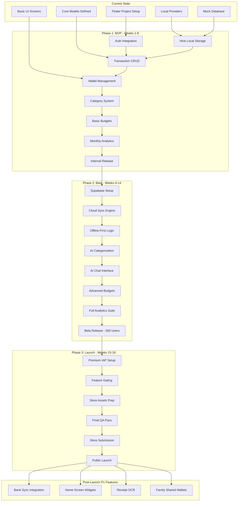
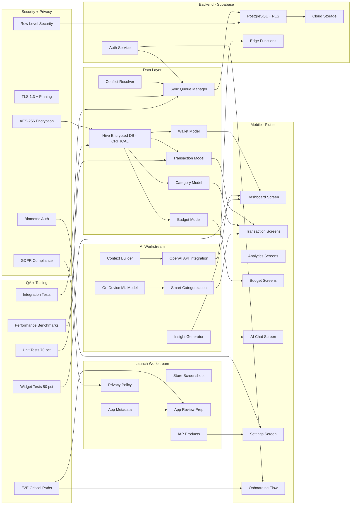
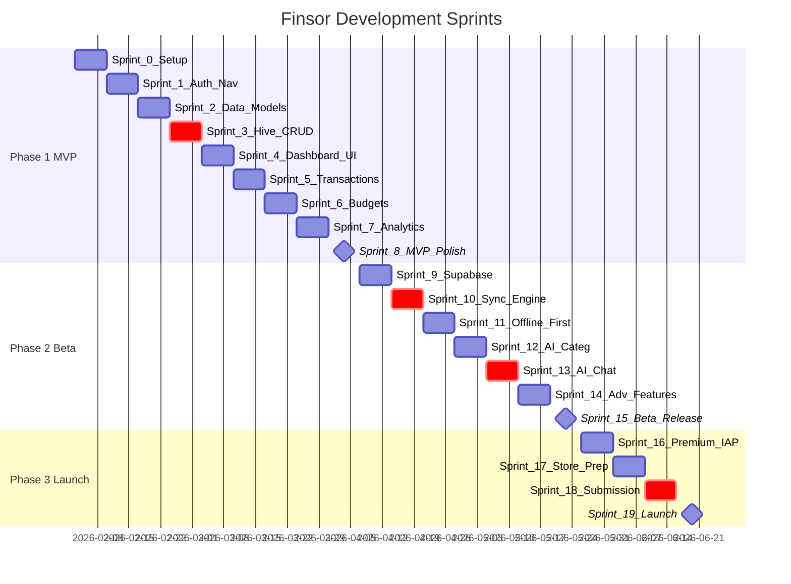

# Finsor Project Roadmap Visualization

> End-to-end project visualization from current state to public launch.
> Based on `FINSOR_PRD_COMPLETE.md` as the single source of truth.

---

## A) High-Level Roadmap Flowchart

**Phases → Milestones → Outputs**

### Phase Summary

| Phase | Duration | Key Output | Exit Criteria |
|-------|----------|------------|---------------|
| **Current** | - | Foundation code | Models, providers, screens scaffolded |
| **Phase 1** | Weeks 1-8 | Internal MVP | All P0 features, 70% test coverage |
| **Phase 2** | Weeks 9-14 | Beta Release | AI 85% accuracy, sync 99% reliable |
| **Phase 3** | Weeks 15-18 | Public Launch | Store approved, crash-free 99.5% |
| **Post-Launch** | 3-6 months | P1 Features | Bank sync, widgets, OCR, family mode |

---

## B) Detailed Dependency Graph

**What depends on what across all workstreams**

### Critical Path Components

| Component | Why Critical | Blocks |
|-----------|--------------|--------|
| **Hive Encrypted DB** | Foundation for all data | All models, sync, AI |
| **Sync Engine** | Offline-first architecture | Cloud features, multi-device |
| **AI Chat** | Key product differentiator | Premium value proposition |
| **Performance Benchmarks** | User experience gate | Store submission |

---

## C) Sprint Timeline

**Sprint 0 → Sprint 19 with key deliverables**

### Sprint Deliverables Detail

| Sprint | Name | Key Deliverables |
|--------|------|------------------|
| **0** | Setup | Project config, CI/CD, linting |
| **1** | Auth + Nav | Supabase auth, GoRouter, onboarding |
| **2** | Data Models | Transaction, Wallet, Category, Budget entities |
| **3** | Hive CRUD | Encrypted storage, basic CRUD operations |
| **4** | Dashboard UI | Home screen, balance card, wallet selector |
| **5** | Transactions | Add/edit/delete, list view, filters |
| **6** | Budgets | Category budgets, progress tracking, alerts |
| **7** | Analytics | Monthly overview, category breakdown, trends |
| **8** | MVP Polish | Bug fixes, QA pass, internal release |
| **9** | Supabase | Cloud config, schema, RLS policies |
| **10** | Sync Engine | Queue manager, conflict resolution |
| **11** | Offline-First | Background sync, connectivity handling |
| **12** | AI Categorization | On-device ML, smart suggestions |
| **13** | AI Chat | OpenAI integration, chat UI, insights |
| **14** | Adv Features | Rollover budgets, goals, full analytics |
| **15** | Beta Release | TestFlight + Firebase distribution |
| **16** | Premium IAP | StoreKit/Billing, feature gating |
| **17** | Store Prep | Screenshots, metadata, privacy labels |
| **18** | Submission | App Store + Play Store review |
| **19** | Launch | Public release, monitoring, support |

---

## D) Release Pipeline

**Dev → QA → Beta → Store Release with gates and criteria**

```mermaid
flowchart TB
    subgraph Development [Development]
        DEV_Local[Local Development]
        DEV_Feature[Feature Branch]
        DEV_PR[Pull Request]
        DEV_Review[Code Review]
    end

    subgraph CI [CI Pipeline]
        CI_Lint[Flutter Analyze]
        CI_Unit[Unit Tests]
        CI_Widget[Widget Tests]
        CI_Coverage["Coverage Check 70 pct"]
        CI_Build[Build Artifacts]
    end

    subgraph QAGate [QA Gate]
        QA_Manual[Manual Testing]
        QA_Integration[Integration Tests]
        QA_Regression[Regression Suite]
        QA_Perf["Perf Benchmarks - CRITICAL"]
    end

    subgraph BetaRelease [Beta Release]
        BETA_TestFlight[iOS TestFlight]
        BETA_Firebase[Android Firebase Dist]
        BETA_Feedback[User Feedback Collection]
        BETA_Crash[Crash Monitoring]
    end

    subgraph PreLaunch [Pre-Launch Gates]
        GATE_CrashFree["Crash Free Rate 99.5 pct"]
        GATE_AIAccuracy["AI Accuracy 85 pct"]
        GATE_SyncReliable["Sync Reliability 99 pct"]
        GATE_NPS["Beta NPS 30 plus"]
        GATE_NoDataLoss[Zero Data Loss]
    end

    subgraph StoreSubmission [Store Submission]
        STORE_Screenshots[Screenshots All Sizes]
        STORE_Privacy[Privacy Nutrition Labels]
        STORE_DataSafety[Data Safety Form]
        STORE_IAP[IAP Product Config]
        STORE_Review[App Review Submission]
    end

    subgraph Compliance [Compliance Checklist]
        COMPLY_GDPR[GDPR Verified]
        COMPLY_Encryption[Encryption At Rest]
        COMPLY_TLS[TLS 1.3 Enforced]
        COMPLY_Biometric[Biometric Tested]
        COMPLY_Accessibility[Accessibility Audit]
    end

    subgraph PublicLaunch [Public Launch]
        LAUNCH_AppStore[App Store Release]
        LAUNCH_PlayStore[Play Store Release]
        LAUNCH_Monitor[24h Crash Monitoring]
        LAUNCH_Reviews[Review Response SLA]
    end

    DEV_Local --> DEV_Feature
    DEV_Feature --> DEV_PR
    DEV_PR --> DEV_Review
    DEV_Review --> CI_Lint

    CI_Lint --> CI_Unit
    CI_Unit --> CI_Widget
    CI_Widget --> CI_Coverage
    CI_Coverage -->|Pass| CI_Build
    CI_Coverage -->|Fail| DEV_Local

    CI_Build --> QA_Manual
    QA_Manual --> QA_Integration
    QA_Integration --> QA_Regression
    QA_Regression --> QA_Perf

    QA_Perf -->|Phase 2| BETA_TestFlight
    QA_Perf -->|Phase 2| BETA_Firebase
    BETA_TestFlight --> BETA_Feedback
    BETA_Firebase --> BETA_Feedback
    BETA_Feedback --> BETA_Crash

    BETA_Crash --> GATE_CrashFree
    BETA_Crash --> GATE_AIAccuracy
    BETA_Crash --> GATE_SyncReliable
    BETA_Feedback --> GATE_NPS
    GATE_SyncReliable --> GATE_NoDataLoss

    GATE_CrashFree --> COMPLY_GDPR
    GATE_AIAccuracy --> COMPLY_GDPR
    GATE_NPS --> COMPLY_GDPR
    GATE_NoDataLoss --> COMPLY_GDPR

    COMPLY_GDPR --> COMPLY_Encryption
    COMPLY_Encryption --> COMPLY_TLS
    COMPLY_TLS --> COMPLY_Biometric
    COMPLY_Biometric --> COMPLY_Accessibility

    COMPLY_Accessibility --> STORE_Screenshots
    STORE_Screenshots --> STORE_Privacy
    STORE_Privacy --> STORE_DataSafety
    STORE_DataSafety --> STORE_IAP
    STORE_IAP --> STORE_Review

    STORE_Review --> LAUNCH_AppStore
    STORE_Review --> LAUNCH_PlayStore
    LAUNCH_AppStore --> LAUNCH_Monitor
    LAUNCH_PlayStore --> LAUNCH_Monitor
    LAUNCH_Monitor --> LAUNCH_Reviews
```

### Gate Criteria Summary

| Gate | Metric | Target | Blocker If |
|------|--------|--------|------------|
| **CI Coverage** | Line coverage | ≥70% | <70% |
| **Performance** | Cold start | <2s | >3s |
| **Performance** | Transaction save | <500ms | >1s |
| **Crash-Free** | Sessions without crash | ≥99.5% | <99% |
| **AI Accuracy** | Correct categorization | ≥85% | <80% |
| **Sync Reliability** | Successful syncs | ≥99% | <95% |
| **Beta NPS** | Net Promoter Score | ≥30 | <20 |
| **Data Loss** | Incidents | 0 | >0 |

### Store Submission Checklist

**App Store (iOS)**
- [ ] Screenshots: 6.7", 6.5", 5.5" sizes
- [ ] App Preview video (15-30s)
- [ ] Privacy nutrition labels completed
- [ ] In-app purchase products created
- [ ] Age rating: 4+
- [ ] Category: Finance

**Play Store (Android)**
- [ ] Feature graphic: 1024x500
- [ ] Screenshots: Phone + Tablet
- [ ] Data safety form completed
- [ ] Target API level ≥34
- [ ] Content rating questionnaire

---

## Current State Analysis

Based on existing `lib/` structure:

| Component | Status | Files |
|-----------|--------|-------|
| **Models** | DEFINED | transaction.dart, wallet.dart, category.dart, budget.dart |
| **Providers** | IN PROGRESS | database_provider.dart, wallet_provider.dart, transaction_provider.dart |
| **Screens** | SCAFFOLDED | home/, analytics/, ai/, settings/, transactions/ |
| **Services** | PARTIAL | database_service.dart, ai_service.dart, export_service.dart |
| **Utils** | COMPLETE | currency_formatter.dart, date_helper.dart, page_transitions.dart |

### Missing for MVP Completion

- [ ] Supabase auth integration
- [ ] Hive encryption setup
- [ ] Real database service (not mock)
- [ ] Complete transaction CRUD
- [ ] Budget tracking logic
- [ ] Analytics calculations

---

## TODO / Undefined in PRD

Items requiring clarification before implementation:

| Item | Status | Decision Needed |
|------|--------|-----------------|
| Bank API partner | TODO | Plaid vs regional providers |
| AI model version | TODO | GPT-3.5 vs GPT-4 (cost/quality) |
| Widget designs | TODO | Specific layouts not specified |
| OCR vendor | TODO | Google Vision vs Apple Vision vs third-party |
| Beta user selection | TODO | Criteria for 500 users |

---

*Generated from FINSOR_PRD_COMPLETE.md - February 2026*
