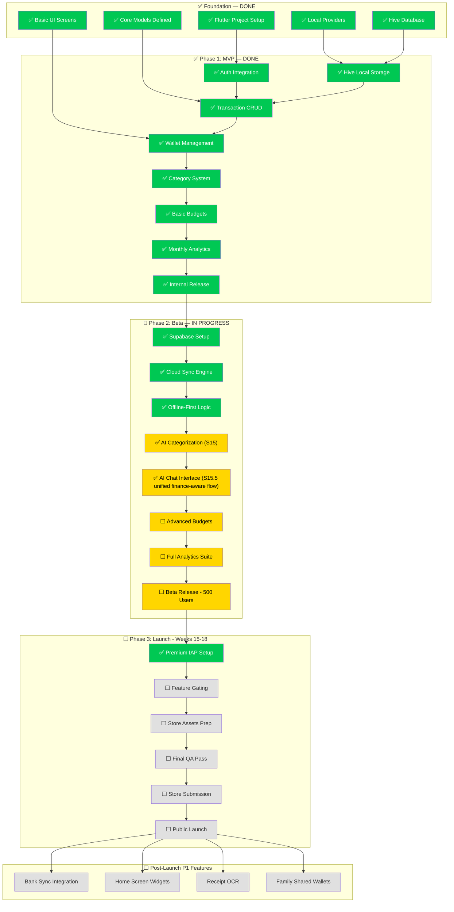
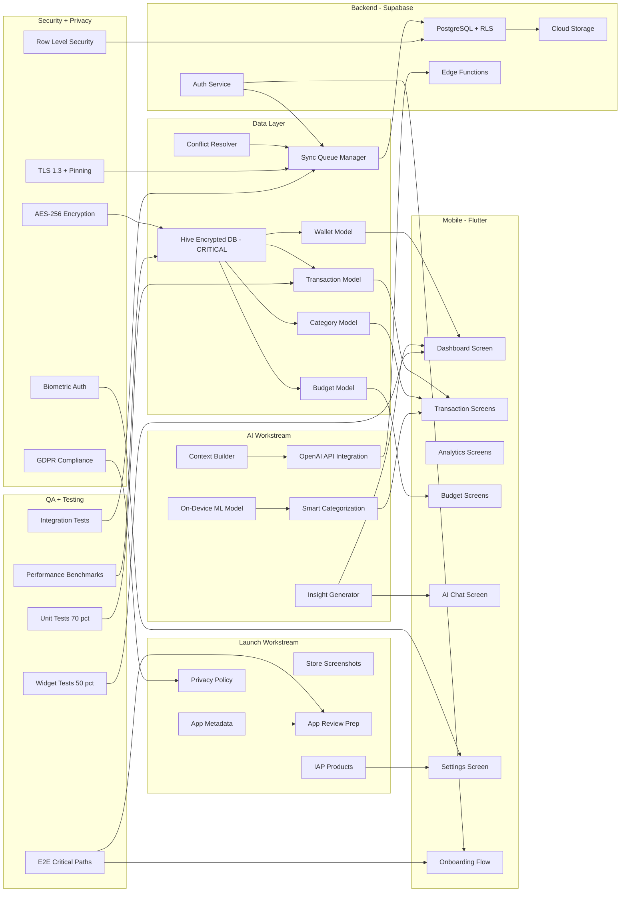
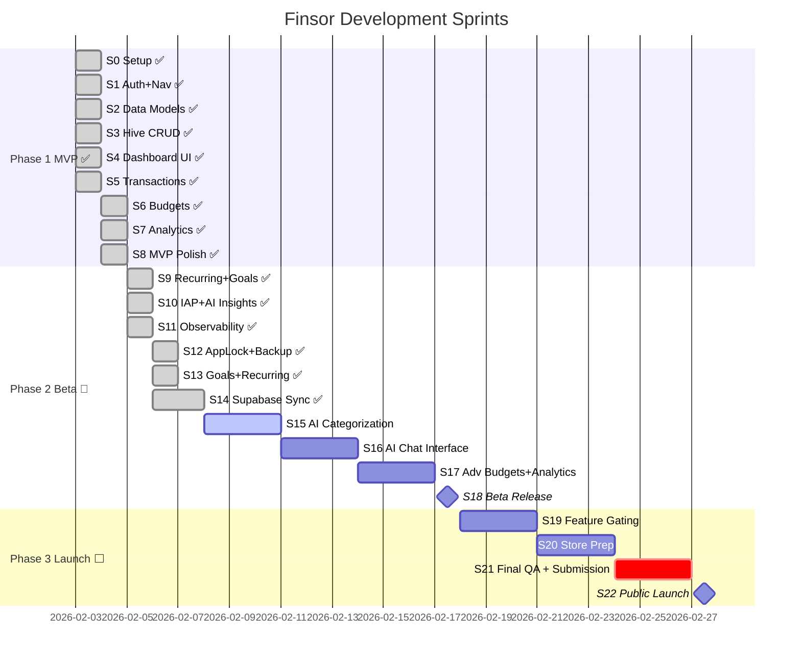

# Finsor Project Visualization

Based on `FINSOR_PRD_COMPLETE.md` analysis, the project has significant foundation code in place (models, providers, screens, services) corresponding to mid-Phase 1. The diagrams below visualize the complete journey from current state to public launch.

**Done:** Full auth system (Sign in / Sign up tabs, Email+Password, Google, Verify email code screen, Forgot password, session persistence, AuthGate). See `docs/auth_supabase_email_templates.md` and `docs/IMPLEMENTATION_SUMMARY_AUTH.md`. **Sprint 19.1:** Auth + Sync critical fixes: AuthGate depends on session (no auto-login after logout), hard logout (SignOutScope.global + Google disconnect), Google account chooser, deep links (reset-password + auth callback), ResetPasswordScreen, sync start/stop on login/logout; see `docs/sprint19_1_auth_fix_summary.md` and `docs/auth_deeplink_setup.md`.

**Paused:** Sign-in temporarily off (`AppConfig.authEnabled = false`, `googleSignInEnabled = false`) while Google Sign-In is paused — app opens to MainScreen offline; flip both flags to `true` to restore.

## A) High-Level Roadmap Flowchart

## B) Detailed Dependency Graph

## C) Sprint Timeline

## D) Release Pipeline

```mermaid
flowchart TB
    subgraph Development [Development]
        DEV_Local[Local Development]
        DEV_Feature[Feature Branch]
        DEV_PR[Pull Request]
        DEV_Review[Code Review]
    end

    subgraph CI [CI Pipeline]
        CI_Lint[Flutter Analyze]
        CI_Unit[Unit Tests]
        CI_Widget[Widget Tests]
        CI_Coverage["Coverage Check 70 pct"]
        CI_Build[Build Artifacts]
    end

    subgraph QAGate [QA Gate]
        QA_Manual[Manual Testing]
        QA_Integration[Integration Tests]
        QA_Regression[Regression Suite]
        QA_Perf["Perf Benchmarks - CRITICAL"]
    end

    subgraph BetaRelease [Beta Release]
        BETA_TestFlight[iOS TestFlight]
        BETA_Firebase[Android Firebase Dist]
        BETA_Feedback[User Feedback Collection]
        BETA_Crash[Crash Monitoring]
    end

    subgraph PreLaunch [Pre-Launch Gates]
        GATE_CrashFree["Crash Free Rate 99.5 pct"]
        GATE_AIAccuracy["AI Accuracy 85 pct"]
        GATE_SyncReliable["Sync Reliability 99 pct"]
        GATE_NPS["Beta NPS 30 plus"]
        GATE_NoDataLoss[Zero Data Loss]
    end

    subgraph StoreSubmission [Store Submission]
        STORE_Screenshots[Screenshots All Sizes]
        STORE_Privacy[Privacy Nutrition Labels]
        STORE_DataSafety[Data Safety Form]
        STORE_IAP[IAP Product Config]
        STORE_Review[App Review Submission]
    end

    subgraph Compliance [Compliance Checklist]
        COMPLY_GDPR[GDPR Verified]
        COMPLY_Encryption[Encryption At Rest]
        COMPLY_TLS[TLS 1.3 Enforced]
        COMPLY_Biometric[Biometric Tested]
        COMPLY_Accessibility[Accessibility Audit]
    end

    subgraph PublicLaunch [Public Launch]
        LAUNCH_AppStore[App Store Release]
        LAUNCH_PlayStore[Play Store Release]
        LAUNCH_Monitor[24h Crash Monitoring]
        LAUNCH_Reviews[Review Response SLA]
    end

    DEV_Local --> DEV_Feature
    DEV_Feature --> DEV_PR
    DEV_PR --> DEV_Review
    DEV_Review --> CI_Lint

    CI_Lint --> CI_Unit
    CI_Unit --> CI_Widget
    CI_Widget --> CI_Coverage
    CI_Coverage -->|Pass| CI_Build
    CI_Coverage -->|Fail| DEV_Local

    CI_Build --> QA_Manual
    QA_Manual --> QA_Integration
    QA_Integration --> QA_Regression
    QA_Regression --> QA_Perf

    QA_Perf -->|Phase 2| BETA_TestFlight
    QA_Perf -->|Phase 2| BETA_Firebase
    BETA_TestFlight --> BETA_Feedback
    BETA_Firebase --> BETA_Feedback
    BETA_Feedback --> BETA_Crash

    BETA_Crash --> GATE_CrashFree
    BETA_Crash --> GATE_AIAccuracy
    BETA_Crash --> GATE_SyncReliable
    BETA_Feedback --> GATE_NPS
    GATE_SyncReliable --> GATE_NoDataLoss

    GATE_CrashFree --> COMPLY_GDPR
    GATE_AIAccuracy --> COMPLY_GDPR
    GATE_NPS --> COMPLY_GDPR
    GATE_NoDataLoss --> COMPLY_GDPR

    COMPLY_GDPR --> COMPLY_Encryption
    COMPLY_Encryption --> COMPLY_TLS
    COMPLY_TLS --> COMPLY_Biometric
    COMPLY_Biometric --> COMPLY_Accessibility

    COMPLY_Accessibility --> STORE_Screenshots
    STORE_Screenshots --> STORE_Privacy
    STORE_Privacy --> STORE_DataSafety
    STORE_DataSafety --> STORE_IAP
    STORE_IAP --> STORE_Review

    STORE_Review --> LAUNCH_AppStore
    STORE_Review --> LAUNCH_PlayStore
    LAUNCH_AppStore --> LAUNCH_Monitor
    LAUNCH_PlayStore --> LAUNCH_Monitor
    LAUNCH_Monitor --> LAUNCH_Reviews
```

## Sprint Progress

### Completed Sprints (S0 – S14) — as of 2026-02-07

| Sprint | What shipped | Tests |
|--------|-------------|-------|
| S0–S5 | Project setup, models, Hive CRUD, dashboard, transaction screens, wallet management, category system | ~80 |
| S6–S7 | Budgets with alerts, monthly + weekly + category analytics, period comparison | ~120 |
| S8 | MVP polish, nav drawer, bottom nav (6 tabs), performance benchmarks (<2s cold start) | ~140 |
| S9 | Recurring transactions (daily/weekly/monthly/yearly), goals (savings + debt), goal reconciliation | ~160 |
| S10 | IAP integration (sandbox-ready), AI Insights (prioritized, de-duplicated, explainable), premium gating | ~190 |
| S11 | Sentry observability, error boundaries (AI/IAP/Export), usage event logging | ~200 |
| S12 | App lock (PIN + biometrics), category delete w/ reassignment, export/import backup, manage categories | ~220 |
| S13 | Goals sync + reconciliation, recurring sync, wallet reassignment | ~240 |
| S14 | **Supabase Cloud Sync**: migrations (schema/RLS/indexes/triggers), auth (Apple/Google/Email OTP), sync engine (outbox/push/pull/conflict/realtime/bootstrap), DEV+PROD env wiring, web OAuth fix, auth-callback route, `config.toml` fix | **282** |

### What Sprint 14 delivered (detail)

- **4 SQL migrations** → 7 tables, RLS policies, indexes, `updated_at` triggers
- **Auth**: Google OAuth (web via Supabase, native via `google_sign_in`), Apple (native), Email OTP (6-digit code, not magic link)
- **Sync Engine**: outbox queue, push (oldest-first, exponential backoff), delta pull (`updated_at > lastSyncAt`), conflict resolution (newer wins, device_id tiebreak), realtime subscriptions, bootstrap
- **Env wiring**: `.env.dev` / `.env.prod` with real keys, `Env.webOrigin`, security guard against `service_role` keys
- **Web auth fix**: `/auth-callback` route, Supabase OAuth redirect, removed `google_sign_in` dependency on web
- **CLI fix**: created `supabase/config.toml` (missing file was causing wrong workdir), comprehensive README with troubleshooting

---

## Current State (2026-02-07)

| Layer | Status | Detail |
|-------|--------|--------|
| **Models** | ✅ Done | Transaction, Wallet, Category, Budget, RecurringTransaction, Goal, SyncOperation, UserSettings |
| **Local DB** | ✅ Done | Hive with encryption, offline-first, metadata store |
| **Providers** | ✅ Done | Database, Settings, Transaction, Wallet, Budget, Analytics, Auth, Sync, Premium |
| **Screens** | ✅ Done | Dashboard, Wallets, Transactions, Add/Edit Transaction, Analytics, Budgets, Goals, Categories, Settings, Onboarding, Login, AI Insights |
| **Auth** | ✅ Done | Apple / Google / Email OTP, provider-agnostic, web + native |
| **Cloud Sync** | ✅ Done | Supabase outbox push/pull, realtime, conflict resolution, bootstrap, DEV+PROD |
| **IAP** | ✅ Done | Sandbox-ready, store-backed premium entitlements |
| **AI Insights** | ✅ Partial | InsightContextBuilder + InsightsService (rule-based). Missing: OpenAI chat, smart categorization |
| **Observability** | ✅ Done | Sentry crash reporting, usage events, error boundaries |
| **Security** | ✅ Done | App lock (PIN + biometrics), service_role guard, RLS on all tables |
| **Tests** | ✅ 282 passing | Unit + widget + integration across 14 sprints |

---

## What's Next — Plan Forward

### S15: AI Smart Categorization (next)
- Train/integrate on-device or rule-based auto-categorization from transaction descriptions
- "Learn from corrections" feedback loop
- >70% acceptance rate target
- Tests for categorization accuracy

### S16: AI Chat Interface
- OpenAI API integration via Supabase Edge Function (or direct with API key)
- Chat UI with suggested questions
- Context window: last 90 days transactions + budgets + goals
- Premium-gated
- Graceful offline fallback

### S17: Advanced Budgets + Full Analytics
- Budget rollover (surplus/deficit carry)
- Envelope budgeting mode
- Spending velocity / pace indicator
- Cash flow timeline chart
- Category heatmap
- Net worth tracking

### S18: Beta Release
- TestFlight (iOS) + Firebase App Distribution (Android)
- Target: 100–500 users
- Crash-free >99.5%, sync reliability >99%

### S19–S22: Launch
- Feature gating polish, store screenshots/metadata, privacy policy, final QA, submission

---

## Critical Path Items Remaining

1. **AI Chat** — key differentiator, requires OpenAI integration + edge function
2. **Smart Categorization** — user-facing AI that improves daily experience
3. **Advanced Budgets** — rollover + envelope = competitive with YNAB
4. **Beta Distribution** — real user feedback before public launch
5. **Store Submission** — screenshots, metadata, privacy labels

## Risks

- OpenAI API cost per user (mitigate: context summarization, caching)
- Google Play review for finance apps (mitigate: privacy policy, data safety form early)
- Supabase free tier limits during beta (mitigate: monitor usage, upgrade plan if needed)

